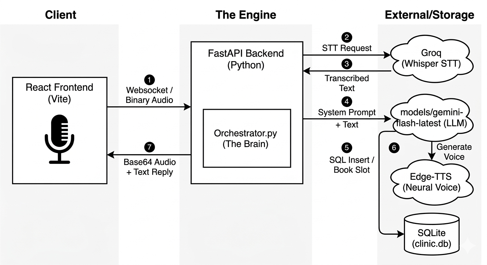

# 2Care.ai: Multilingual Voice AI Medical Assistant:

A high-performance, real-time Voice AI agent designed to bridge the gap between healthcare providers and patients. The system allows users to book medical appointments using natural speech in **English, Hindi, Telugu, and Tamil**, providing an instant, multilingual voice-to-voice experience.

This project was developed for the **2Care.ai Engineering Challenge**, focusing on low-latency orchestration, native regional language support, and robust asynchronous architecture.

## Architectural Decisions

The system follows a **Modular Orchestration Pattern** to ensure each component (STT, LLM, TTS) can be scaled or swapped independently.

1. **FastAPI & WebSockets:** Chosen over standard REST to handle full-duplex audio streaming. This allows the frontend to send audio "chunks" and the backend to respond without the overhead of repeated HTTP handshakes.
2. **Gemini 1.5 Flash (via `google-genai`):** Selected for its industry-leading speed-to-intelligence ratio. The "Flash" model is specifically optimized for sub-second reasoning, which is critical for voice agents.
3. **Groq (Whisper-large-v3):** Utilized for Speech-to-Text due to its "LPU" inference engine, providing near-instant transcription (typically < 500ms).
4. **Edge-TTS (Neural):** Provides high-fidelity, human-like neural voices for Indian regional languages (Shruti for Telugu, Swara for Hindi) without the high costs or latency of traditional cloud providers.

## Technologies I've Used:

### Frontend:

- **React.js (Vite):** For a lightning-fast development server and optimized production build.
- **Web Audio API:** To handle real-time microphone capture and Base64 audio playback.
- **Lucide React:** For a clean, minimal medical iconography.
- **CSS3 Animations:** Custom pulse-engine for the recording interface.

### Backend:

- **Python 3.10+**
- **FastAPI:** High-performance asynchronous framework.
- **Google GenAI SDK:** Utilizing the latest `aio` (Asynchronous I/O) client.
- **SQLite3:** For lightweight, persistent appointment storage.
- **Edge-TTS:** For localized speech synthesis.

## Memory Design

The agent utilizes a dual-layer memory approach:

1. **Short-Term (Session Store):** An in-memory dictionary tracks current user interactions and language preferences for the duration of the WebSocket connection.
2. **Long-Term (Persistent DB):** A SQLite database (`clinic.db`) stores confirmed appointments, doctor specialties, and availability, ensuring data persists even if the server restarts.

## ⚡ Latency Breakdown

To achieve a "human-like" conversation, we targeted a total response time (TRT) of **< 3 seconds**:

| Component | Technology | Estimated Latency |
| **STT** | Groq / Whisper-v3 | ~400ms - 600ms |
| **LLM Response** | Gemini 1.5 Flash | ~800ms - 1.2s |
| **TTS Generation** | Edge-TTS | ~300ms - 500ms |
| **Network/WS** | WebSocket Overhead | ~100ms - 200ms |
| **Total** | **End-to-End** | **~2.0s - 2.5s** |

## Tradeoffs and Limitations

### Tradeoffs:

- **Flash vs. Pro Models:** I chose **Gemini 1.5 Flash** over the "Pro" version. While Pro is more creative, Flash provides the low-latency response required for a voice-based conversation where a 5-second delay would feel awkward.
- **Client-Side Recording:** Audio is processed in `webm` format on the client to reduce upload bandwidth, even though `wav` would provide slightly higher quality.

### Known Limitations:

- **Free Tier Quotas:** The system is subject to the Gemini Free Tier limit (currently 15-20 requests per minute).
- **Noise Cancellation:** Performance may degrade in extremely noisy environments as the current STT doesn't have a background-noise suppression filter.
- **Single Appointment Flow:** The current logic assumes one appointment per session; complex rescheduling flows are currently out of scope.

## Project Structure:

voice-ai-agent/
├── backend/
│ ├── agent/ # AI Brain (Orchestrator)
│ ├── services/ # STT, TTS, and Database logic
│ ├── memory/ # Session handling
│ ├── main.py # FastAPI Entry Point
│ ├── clinic.db # SQLite Database
│ └── requirements.txt # Backend Dependencies
├── frontend/
│ ├── src/
│ │ ├── components/ # Home/index.jsx & Styles
│ │ └── App.jsx # Routing and logic
│ └── package.json # Frontend Dependencies
└── README.md

## Installation and Setup:

### Backend Setup:

cd backend
python -m venv venv
source venv/bin/activate # On Windows: venv\Scripts\activate
pip install -r requirements.txt

**Environment Variables (.env):**
GEMINI_API_KEY=your_key
GROQ_API_KEY=your_key

**Run Backend:**
python main.py

### Frontend Setup:

cd frontend
npm install
npm run dev

## Owner:

**Chandu Naidu**
MERN & AI Stack Developer focused on building high-performance, multilingual AI solutions with clean architecture.
